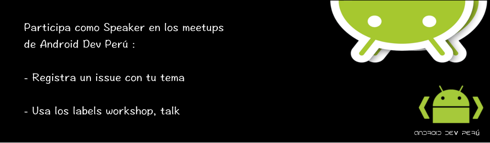

== Android Dev Perú

=== Propuestas de charlas para los meetups

Este repo tiene como propósito proponer temas para los meetups. Al mismo tiempo, otros miembros pueden votar por las charlas con reacciones.

Para realizar una propuesta, seguir los siguientes pasos:

. Registrar un **https://github.com/Android-Dev-Peru/propuestas-meetup/issues[issue^]** con el tema de tu charla y una descripción.
. No te olvides de dejar un medio de contacto: número de celular o correo electrónico.
. Es importante asignar la etiqueta `workshop` o `talk` dependiendo del contenido de tu charla.

Nosotros nos pondremos en contacto contigo :D

## Links

. Meetup Android Dev Perú https://www.meetup.com/es-ES/Android-Dev-Peru/[https://www.meetup.com/es-ES/Android-Dev-Peru/^]

. Repositorio https://github.com/Android-Dev-Peru[https://github.com/Android-Dev-Peru^]

. Grupo en Facebook https://www.facebook.com/groups/androidpe/[https://www.facebook.com/groups/androidpe/^]
